# dnshelper user guide

This guide is for the person who administers an NS8 node. It explains what dnshelper does, how to
give it access to your DNS host, how to decide which modules may change which records, and how to
check that everything works. Developers who want to call dnshelper from their own module should
read the [main README](../README.md) instead.

- [What dnshelper does](#what-dnshelper-does)
- [Before you start](#before-you-start)
- [Adding a zone](#adding-a-zone)
- [Managing zones and credentials](#managing-zones-and-credentials)
- [Letting modules change DNS records](#letting-modules-change-dns-records)
- [Trying it out: the Records page](#trying-it-out-the-records-page)
- [Seeing what happened: the audit log](#seeing-what-happened-the-audit-log)
- [Backup and restore](#backup-and-restore)
- [When something goes wrong](#when-something-goes-wrong)

## What dnshelper does

Some NS8 modules need to change DNS records: a mail server publishing its DKIM key and SPF record,
a certificate client proving that you own a name, a web application publishing its own host name.
Instead of every module asking you for DNS credentials, they ask dnshelper.

dnshelper keeps the credentials for your DNS host, and it keeps a list of rules that say which
module may change which records. A module can only do what a rule allows. Nothing happens to your
DNS until you have done two things:

1. **Add a zone** (a domain, such as `example.com`) and the credential dnshelper uses for it.
2. **Add an access rule** for each module that should be allowed to change records in it.

You, as an administrator, are never limited by the rules: the pages of dnshelper always act with
full access to the zones you added.

The pages of the application, in the side menu:

| Page | What it is for |
|---|---|
| **Status** | How many zones and rules there are, and a shortcut to the audit log |
| **Zones** | The zones dnshelper manages, and the credentials they use |
| **Records** | Look at the records of a zone, and add or delete one |
| **Access** | The rules that decide what each module may change |
| **About** | Version and links |

## Before you start

You need **an API credential from your DNS host**. It is not your account password. It is a token
(or a key, or a user name and password made for the purpose) that you create in your DNS host's
control panel and that only allows what dnshelper needs.

Make the credential as narrow as your DNS host lets you: limited to the zones you want dnshelper to
manage, and allowed to edit DNS records. If it is ever leaked, that limits the damage, and you can
revoke it at your DNS host without touching anything else.

| DNS host | What dnshelper asks for | Where to create it |
|---|---|---|
| Cloudflare | An API token that can edit DNS for your zones (the "Edit zone DNS" permission). If the token is limited to one zone, a second token that can read zones is also asked for, so that the zone list works | [Create an API token](https://developers.cloudflare.com/fundamentals/api/get-started/create-token/) |
| Core-Networks ([core-networks.de](https://www.core-networks.de/)) | The login and password of an **API account**. This is not the login you use in the web interface: make a separate API account in the web interface, under API user accounts | [Core-Networks API documentation](https://beta.api.core-networks.de/doc/) |
| deSEC | An API token, made under **Token Management**. It needs neither **Can create domains** nor **Can delete domains**. In the advanced settings, leave **Maximum unused period** empty: dnshelper only uses the token when a record changes, so the token could expire in between. If you limit the token to a subnet, include your NethServer's public address | [Manage tokens](https://desec.readthedocs.io/en/latest/auth/tokens.html) |
| DigitalOcean | A personal access token with **custom scopes**: tick `domain` with create, read, update and delete, and nothing else. DigitalOcean cannot limit a token to some domains: it can change every domain in the account (or team) | [Personal access tokens](https://docs.digitalocean.com/reference/api/create-personal-access-token/) |
| Gandi LiveDNS | A personal access token, made in the Gandi Admin application for the organization that holds your domains, with the permission **Manage domain name technical configurations** (Gandi then also ticks **See and renew domain names**). You can limit it to some domains. Gandi tokens expire: renew or replace yours before its end date, then update the credential here | [Authentication](https://api.gandi.net/docs/authentication/) |
| GoDaddy | A personal access token that can read your domains and manage their DNS records. The older "classic" API key and secret still work, but GoDaddy is retiring them | [GoDaddy developer site](https://developer.godaddy.com/en/docs/api-users/auth) |
| Hetzner | A Hetzner Cloud API token with **Read & Write** permission, made in the project that holds your DNS zones | [Generating an API token](https://docs.hetzner.com/cloud/api/getting-started/generating-api-token/) |
| Linode (Akamai) | A personal access token with **Domains** set to Read/Write and every other scope to No Access. The token reaches every domain of the account, unless you make it as a restricted user granted only some domains | [Manage personal access tokens](https://techdocs.akamai.com/cloud-computing/docs/manage-personal-access-tokens) |
| name.com | Your user name and an API token. Use a **production** token: a development token does not work | [Get your API token](https://docs.name.com/getting-started) |
| Porkbun | The API key and secret API key. Porkbun only lets the key reach domains with **API access** switched on: switch it on for all domains at once, or in the settings of each domain dnshelper should manage | [Porkbun API access](https://kb.porkbun.com/article/190-getting-started-with-the-porkbun-api) |
| Amazon Route 53 | The access key ID and secret access key of an IAM user that may only read and change the records of your hosted zones, and list hosted zones. The README has the exact policy | [IAM access keys](https://docs.aws.amazon.com/IAM/latest/UserGuide/id_credentials_access-keys.html) |
| Vultr | Your API key, from **Account > API**. The account's key reaches your whole Vultr account, not only DNS. If the key's access control is limited to some addresses, add your NethServer's public address | [Vultr API](https://www.vultr.com/api/) |
| RFC 2136 (BIND, Knot, PowerDNS...) | The server address and port, the name of a TSIG key, its algorithm and the key. The server must allow dynamic updates and zone transfers (AXFR) for that key | Your DNS server's configuration |

If your account uses two-step authentication, your DNS host may need API access switched on before
tokens work; its documentation says how.

## Adding a zone

Open **Zones** and choose **Add zone**. A four-step wizard asks for everything, and nothing is
saved until the last step.

**1. Choose the DNS host.** Pick where the zone is hosted. The wizard lists what dnshelper can do
with that host. If you already saved a credential for it, you can choose that one and skip the
next step.

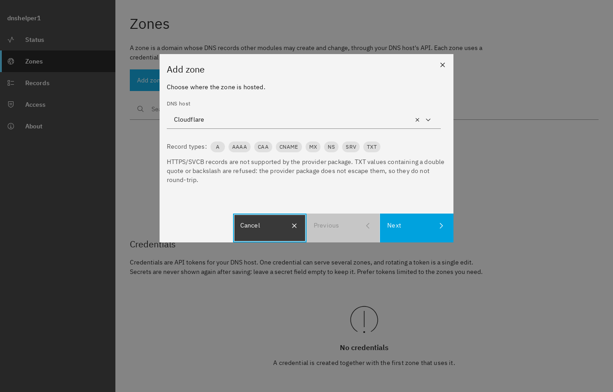

**2. Enter the credential.** Give it a name you will recognise later (for example the DNS host and
the zone), then fill in the fields your DNS host needs. Secret fields are masked (the eye icon
shows what you typed) and can never be read back once saved.

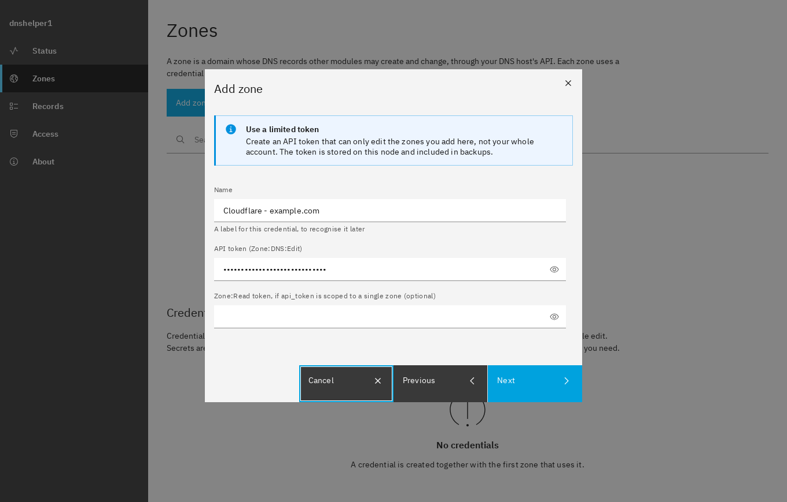

**3. Choose the zone.** If the credential can list its zones, pick one from the list, or type the
name. Some DNS hosts cannot list zones, and then you type it. **Find zones used by my modules**
shows the domains that your mail, web server and other modules already use, so you can pick one.
They are suggestions only: a domain your mail server uses is not necessarily hosted at this DNS
host.

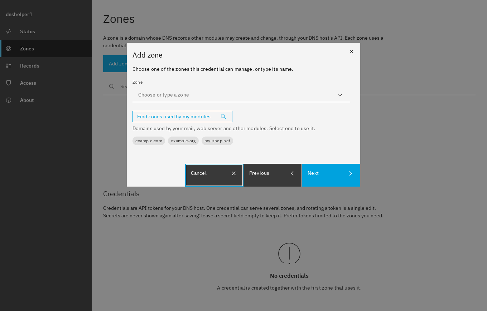

**4. Review.** dnshelper checks that the credential works for the zone and shows what it can do
there (read, add, replace and delete records). It does not change anything while checking. Choose
**Test write access** if you also want proof that changes are allowed: dnshelper then adds a
temporary TXT record named `_dnshelper-test-...` and deletes it again. Nothing else is touched.

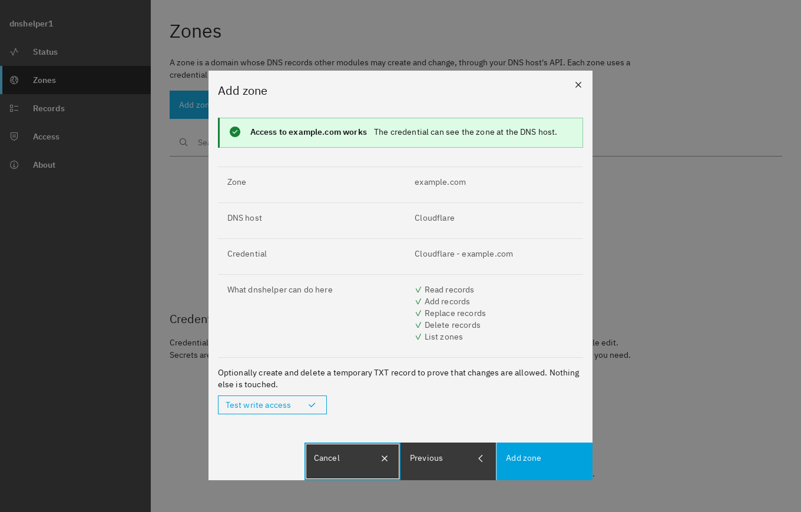

If the check fails, the message says why (see [When something goes wrong](#when-something-goes-wrong)).
Choose **Previous** to correct the credential or the zone.

## Managing zones and credentials

The **Zones** page has two tables.

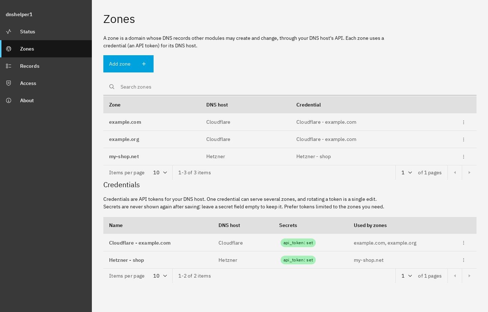

**Zones.** The three dots at the end of a row open a menu:

- **Check credentials** tests again that the credential works for the zone. Use it after you
  changed something at your DNS host.
- **Change credential** makes the zone use another saved credential from now on. The records are
  not touched.
- **Delete** stops managing the zone. dnshelper asks you to type the zone name to confirm. The
  records at your DNS host are **not** deleted, and the credential is kept. Modules can no longer
  change the zone's records.

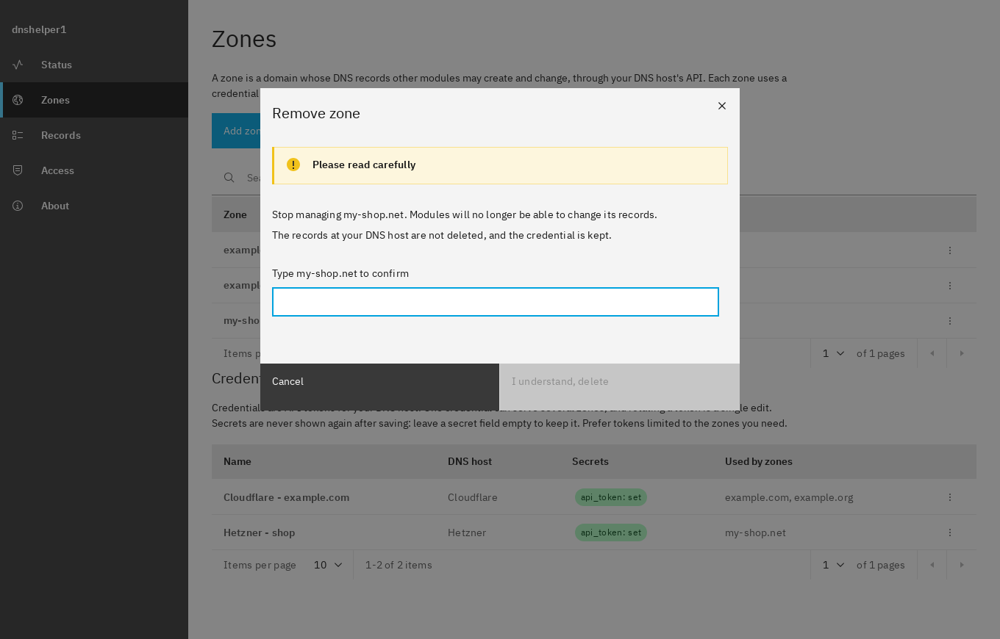

**Credentials.** One credential can serve several zones. The table shows which zones use each one.

- **Edit** changes the name or the values. Secret fields are empty when you open the dialog:
  leave a secret empty to keep the stored value, or type a new one to replace it. **This is how
  you rotate a token**: create a new one at your DNS host, edit the credential here, and then
  revoke the old token.
- **Delete** removes a credential that no zone uses. The token stays valid at your DNS host: revoke
  it there too if it should stop working.

## Letting modules change DNS records

Modules are **denied everything until you allow them**. A module that is installed and allowed to
*call* dnshelper still cannot read or change a single record until there is a rule for it. That is
deliberate: a module that misbehaves, or a bug, can only touch what you granted.

If a module is refused, its own error will say something like "not permitted", and dnshelper's
audit log shows the refusal. That means a rule is missing.

Open **Access**. The table lists the rules.

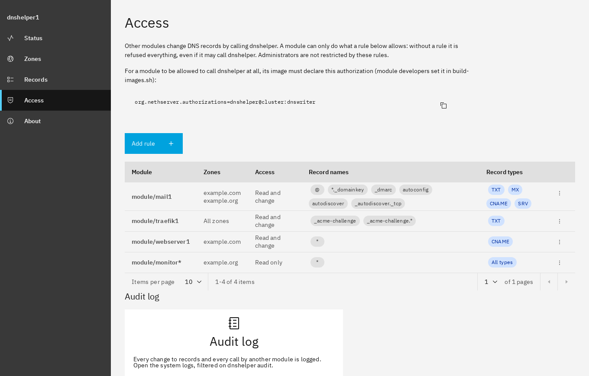

Each rule has:

| Field | Meaning |
|---|---|
| **Module** | `module/` followed by the module's name, such as `module/mail1`. A pattern works too: `module/mail*` covers every module whose name starts with `mail` |
| **Zones** | The zones the rule covers: tick one or several, or **All zones** |
| **Access** | *Read only* lets the module look at records. *Read and change* also lets it add and delete them |
| **Record names** | Which names the module may touch, relative to the zone. `@` is the zone itself, `www` is `www.example.com`. `*` matches any text (dots included) and `?` matches one character, so `*._domainkey` matches `mail._domainkey`. A single `*` means every name |
| **Record types** | Which types, such as `TXT, MX`. A single `*` means every type. A module can only delete without naming a type if the rule says `*` |

A module's request is checked as a whole: if any record in it is not covered, nothing is changed.
Reading follows the same rules: a module only sees the records a rule covers, and only the zones
it has a rule for.

Choose **Add rule**. Four buttons at the top fill in typical values so you do not have to type
them; you still choose the module and the zones.

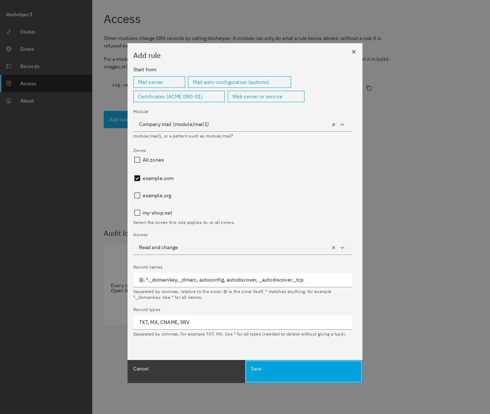

| Preset | Record names | Record types | For |
|---|---|---|---|
| **Mail server** | `@`, `*._domainkey`, `_dmarc`, `autoconfig`, `autodiscover`, `_autodiscover._tcp` | TXT, MX, CNAME, SRV | A mail server publishing its SPF, DKIM and DMARC records, MX and mail auto-configuration |
| **Mail auto-configuration (automx)** | `autoconfig`, `autoconfig.*`, `autodiscover`, `autodiscover.*`, `_autodiscover._tcp`, `_autodiscover._tcp.*` | CNAME, SRV | [ns8-automx](https://github.com/danb35/ns8-automx), publishing the records mail clients use to find their settings, for mail domains at a zone's apex or below it |
| **Certificates (ACME DNS-01)** | `_acme-challenge`, `_acme-challenge.*` | TXT | A module that proves domain ownership to get a certificate, for example a wildcard certificate |
| **Web server or service** | `*` | CNAME | A web server, or an application on its own host name (SOGo, Grafana, Matomo...), that points a name at your server |

Some habits that keep this safe:

- **Grant the least that works.** Name the zones instead of *All zones* when a module only needs
  one, and leave the presets' names and types as they are unless you know why you need more.
- **Prefer *Read only*** for anything that only needs to look, such as a monitoring module.
- The three dots at the end of a row let you **edit** or **delete** a rule. Deleting takes effect
  at once.
- A rule can be added before the module is installed, and stays until you delete it. After a
  restore, a rule for a module that no longer exists is kept.

The **Access** page also shows the line that a module's developers add to their image so that the
module may call dnshelper at all (`org.nethserver.authorizations=dnshelper@cluster:dnswriter`).
You do not need to do anything with it: it is there for people who write modules.

## Trying it out: the Records page

**Records** lets you see and change the records of a zone yourself, through dnshelper and the
credential the zone uses. It is the quickest way to check that everything works before a module
depends on it. It is meant for trying dnshelper and for the occasional change, not as a full DNS
editor: there is no in-place editing and no bulk change.

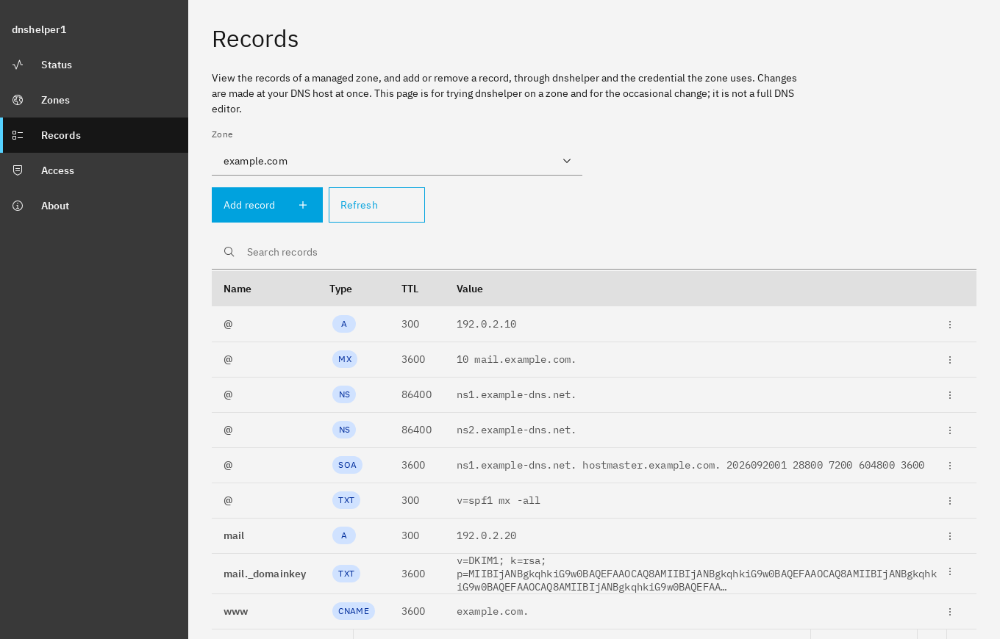

Pick a zone, and the table lists its records: the zone itself first, then by name and type. You
can search and sort. Long values, such as a DKIM key, are shortened; hover over one to see all of
it. **Refresh** reads the zone again.

**Add record** asks for a name (`www`, or `@` for the zone itself), a type, a value and an optional
TTL. The type list only offers what your DNS host can handle, and the field shows an example of
what the value looks like for that type. Existing records are never changed by adding one.

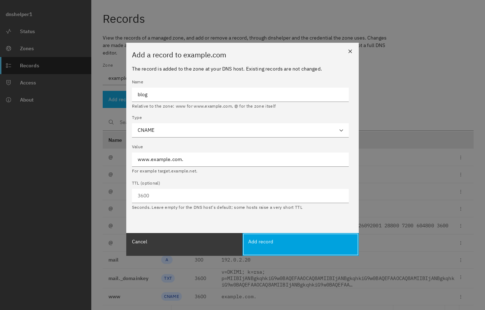

Some notes about values:

- A TXT record is one plain piece of text. Do not add quotes: dnshelper does that where the DNS
  host needs them.
- MX values are `priority target`, such as `10 mail.example.com.`; SRV values are
  `priority weight port target`.
- Leave the TTL empty to use your DNS host's default. Some hosts have a minimum TTL and raise a
  shorter one, so the record you see afterwards can have a different TTL from the one you typed.

The three dots at the end of a row let you **delete** the record, after a confirmation. Other
records with the same name stay. The zone's NS and SOA records cannot be deleted.

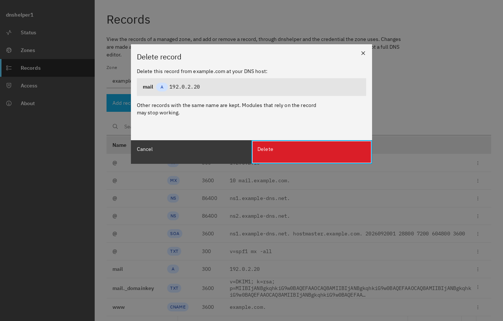

Changes are made at your DNS host at once, and they are real: deleting the record of a running
service takes the service down. Records that other modules rely on (for example a mail server's
DKIM key) are best left to the module.

## Seeing what happened: the audit log

Every change dnshelper makes, and every request from another module, writes one line to the
system log, including the ones that were refused. On **Status**, the **Audit log** card opens the
system logs already filtered on `dnshelper audit`; choose **Search** there. A line looks like:

```
dnshelper audit: caller="module/mail1" action="append-records" result="ok"
    zone="example.com" add=["mail._domainkey TXT v=DKIM1..."] remove=[]
```

`caller` is the module (or your administrator name for changes from the Records page), `result` is
`ok` or `rejected`, and a rejection carries the reason. Credentials never appear in the log.

## Backup and restore

dnshelper's backup includes its zones, its access rules **and its credentials**, because a restore
would otherwise leave you with zones that cannot be changed. After a restore, everything is back
and the credentials still work.

Because the credentials are in the backup, treat your backup destination as sensitive. NS8
encrypts backups, but a narrow, revocable token (see [Before you start](#before-you-start)) is
still your best protection.

## When something goes wrong

These are the messages you may see, with what to check.

| Message | What it means and what to do |
|---|---|
| The DNS host rejected the credential, or it has no access to this zone | The token is wrong, expired or revoked, or it is limited to other zones or lacks the DNS permission. Check it at your DNS host, and check that a Hetzner token comes from the project that holds the zone, or that a name.com token is a production token |
| Zone not found at the DNS host, or not managed here | The zone name is misspelled, or the zone is not in the account this credential belongs to. For a module's request: the zone was never added on the **Zones** page |
| Not allowed by the access rules | A module tried something no rule covers. Open **Access** and check the module, the zone, the record names and types, and whether the rule is *Read only* |
| That would leave the zone invalid | The change would break DNS rules, most often a CNAME next to other records with the same name, or a CNAME at the zone itself. Remove the conflicting record first |
| That record cannot be changed | dnshelper never changes a zone's NS and SOA records. Some DNS hosts also cannot store certain characters: Cloudflare, name.com, RFC 2136 and Vultr do not accept a TXT value that contains a double quote or a backslash, DigitalOcean and Porkbun one that contains a backslash, and Hetzner one that starts or ends with a double quote. DigitalOcean also refuses an underscore in the name of an A or AAAA record, and Linode an SRV record below a subdomain (it only stores `_service._protocol` directly under the zone) |
| This DNS host does not support that | The DNS host cannot do it: for example a record type it does not handle. The review step of the wizard lists what it can do |
| The credential is still used by a zone | Change the zone's credential, or delete the zone, before deleting the credential |

A few more things that look like problems and are not:

- **A record has a different TTL from the one requested.** GoDaddy raises a TTL below 600 seconds
  to 600, name.com below 300 to 300, Core-Networks below 60 to 60, DigitalOcean below 30 to 30, Porkbun below 60 to 60, Gandi below 300 to 300, Vultr below 60 to 60, and deSEC below the domain's own minimum to that minimum. Linode rounds any TTL up to the next value it allows (30, 120, 300, 3600, ...).
- **Hetzner and Vultr are slow.** Each action takes several seconds there (8 to 15 at Hetzner); that is the DNS host, not a fault.
- **GoDaddy limits the number of requests** to about 60 a minute. dnshelper waits and tries again.
- **deSEC limits changes** to 15 a minute and 100 an hour per domain. dnshelper waits up to 90 seconds;
  beyond that it says how long to wait before trying again.
- **Core-Networks limits how often you can log in.** dnshelper logs in once and reuses the session for
  up to an hour. If you see that logins are limited, wait a few minutes and try again.
- **The zone list is empty or the wizard asks you to type the zone.** Some credentials are not
  allowed to list zones, and some DNS hosts cannot. Type the zone name.

If something still does not work, the audit log and the system log of the dnshelper module (Logs
in the NS8 admin interface, module `dnshelper`) show what was asked and what was answered.
Please report bugs at <https://github.com/danb35/ns8-dnshelper/issues>; do not include tokens or
passwords.
